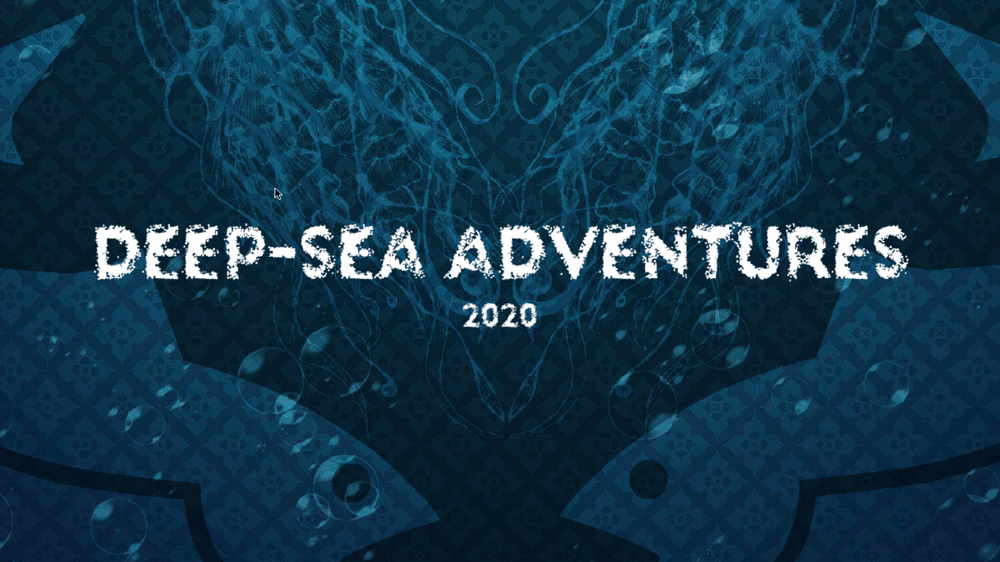

# Deep-Sea Adventures
Interactive survival game made with PyGame.

## Description
It's survival of the biggest in this action packed deep-sea challenge. Eat your way to the top of the food chain as you swim through stunning underwater environments and encounter deadly predators. In Deep-Sea Adventures, players control a hungry marine predator intent on munching as many other fish as possible. The player chooses beetwen 3 aquatic species each trying to move up the food chain as the game progresses. As smaller fish are eaten, the player's own fish grows in size and becomes capable of eating somewhat larger fish. By the end of level 4, the fish is sufficiently large enough that it can eat almost anything on-screen. Players must be vigilant for danger signs as the ultimate shark predator might end their adventures.

## Game instructions
Players move their fish using the mouse, trying to catch other smaller fish while avoiding bigger fish. If bigger fish is to catch player's fish, the game will be over. Player can pause the game at any point by pressing the key "P" or exit the game at any point by pressing the key "ESC". The danger sign will randomly appear at the higher levels and the ultimate shark predator will pass the screen. If the player's fish gets caught by the ultimate shark predator, the game will be over. Completing the tasks will make player's fish bigger which will give the player the ability to eat somewhat larger fish. Complete all tasks and have fun adventures!

## Implementation
Whole project is made in Python 3 using PyGame library.  Development environment is PyCharm.

## Game images
For some images from the game click [here](img/Gameplay/).

## Installation
To make executable file, within project directory type:
`python setup.py build` then open *main.exe* file. Enjoy!

